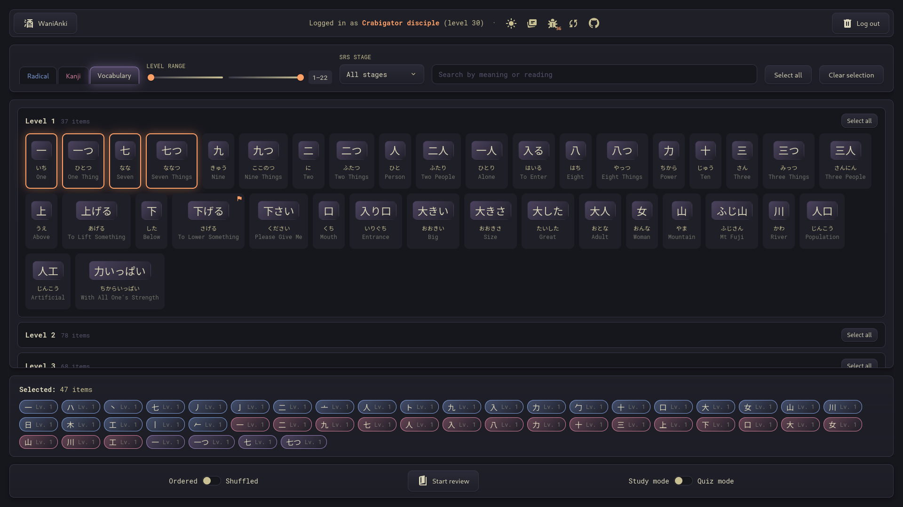
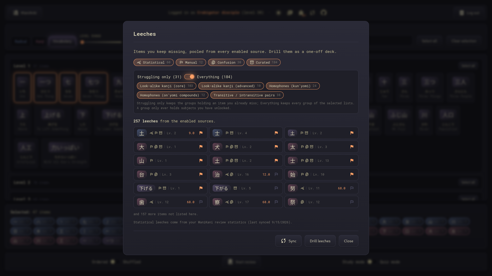

# WaniAnki

A lightweight web application that **fetches review subjects from your WaniKani account and lets you review them offline**. All review data is persisted locally using the browser **Origin Private File System (OPFS) API**, and **your API token is never persisted** — it is held in memory only for the duration of a request, then discarded. Select subjects by type (radical, kanji, vocabulary), filter by level range, or search by meaning or reading.

## Features

- 📴 **Offline reviews** — review cached subjects without an active network connection.
- 🎯 **Flexible selection** — filter by subject type, level range, and SRS stage, search by meaning or reading, or toggle entire levels at once.
- 💾 **Local persistence** — WaniKani data is stored in-browser using the OPFS API, while decks, leech pins and preferences live in local storage.
- 📚 **Two review modes** — study mode for reading content, quiz mode for testing yourself.
- 🗂️ **Saved review decks** — save your current selection as a named deck and load it later for quick access.
- 🐛 **Leech drilling** — pool the items you keep missing from your review statistics, your own pins, look-alike kanji and bundled lists of commonly confused items, then drill them as a deck.
- 🔄 **Sync with WaniKani** — refresh your SRS stages and fetch new subjects when you level up, re-entering your API token just for that request.
- 📊 **Quiz summary** — view your quiz results and create a new deck from incorrect answers to focus your practice.
- ⌨️ **Easy keyboard navigation** — use keyboard shortcuts to easily navigate through review subjects.
- 🔒 **API token safety** — the API token is never written to storage. It is held in memory only while a request is in flight, then discarded.

## Usage


Provide a valid WaniKani personal access token with `all_data:read` permission.


Select subjects using the tabbed filter (radical, kanji, vocabulary), adjust the level range with sliders, filter by SRS stage (Locked, Apprentice 1–4, Guru 1–2, Master, Enlightened, Burned), or search by meaning or reading with autocomplete suggestions. Browse subjects grouped by level, toggle entire levels at once, or click individual items. Selected subjects appear as removable chips at the bottom. Choose ordered or shuffled review, then start in either study mode or quiz mode.

Use the sync button in the header to refresh the SRS stages of your subjects, and to fetch your new subjects when you have leveled up on WaniKani. You'll be prompted to re-enter your API token, which is used only for that request and then discarded.

## Study Mode vs Quiz Mode

### Study Mode


A read-only mode for reviewing subject details. Displays the full breakdown of each subject including meanings, mnemonics, hints, radical combinations, and readings (on'yomi, kun'yomi, nanori). Navigate freely between subjects to reinforce your memory.

### Quiz Mode


An interactive mode that tests your knowledge. You'll be prompted to type in either the meaning or reading of each subject. Answers are validated as you go — readings require an exact hiragana match, while meanings allow for close answers using fuzzy matching.

### Quiz Summary

After completing a quiz, you'll see a summary of your results with accuracy statistics broken down by subject type and quiz type. If you got any answers wrong, you can create a new deck from those items to focus your practice. When quizzing from an existing deck, you can also update that deck to contain only the items you missed.

## Leeches



Leeches are the items you keep getting wrong. WaniKani publishes the raw review statistics but never tells you which items have become chronic failures, so WaniAnki works that out itself. Open the leech dialog from the dashboard header to pool them from four sources, then drill the result as a one-off deck.

Every source is a toggle showing how many items it contributes. An item found by more than one source is listed once and labelled with all of them, and statistical leeches carry their score.

### Statistical

Chronic failures computed from your WaniKani review statistics.

They are scored with the formula used by the WaniKani leech-table userscripts, computed separately for meaning and reading, and an item keeps the higher of the two. An item counts as a leech once its score reaches 1. The exponent and that cutoff are WaniAnki's defaults, not settings:

```
score = incorrect / max(current_streak, 1) ** 1.5
```

This source needs your review statistics, which the **Sync** button fetches. As with every other request, your API token is used once and then discarded, and the result is cached in OPFS alongside the rest of your data.

### Manual

Items you pinned yourself with the flag toggle, on any subject card in the dashboard selection list, in the leech list, or in the quiz summary.

### Confusion

Kanji you keep missing, paired with the look-alikes WaniKani lists for them, limited to the ones you have already unlocked or already miss.

Confusion groups are always drilled whole — 土 never turns up without 士. Look-alikes you have neither unlocked nor already miss are dropped from the group, so a kanji left without any look-alike contributes nothing.

### Curated

Groups of commonly confused items bundled with WaniAnki: look-alike kanji (core and advanced), kun'yomi homophones, on'yomi compound homophones, and transitive / intransitive verb pairs.

Curated lists are selected individually and come with a scope switch: **Struggling only** keeps the groups holding an item you already miss, while **Everything** keeps every group of the selected lists. Their groups are drilled whole on the same terms as confusion groups, and a group left with fewer than two items is dropped.

### Drilling the pool

**Drill leeches** loads the pooled items as your current selection, replacing whatever was selected, so the usual study and quiz modes take over from there.

## Keyboard Shortcuts

### Study Mode

| Action           | Shortcut                   |
| ---------------- | -------------------------- |
| Next subject     | Space; Enter               |
| Previous subject | Ctrl + Space; Ctrl + Enter |
| Exit to dashboard| Escape                     |

### Quiz Mode

| Action                     | Shortcut |
| ---------------------------| -------- |
| Submit answer / Next review| Enter    |
| Exit to dashboard          | Escape   |

## Development

```bash
npm install           # Install dependencies
npm run dev           # Start development server
npm run build         # Create production build
npm run preview       # Serve production build
npm run test          # Run the test suite
npm run lint          # Run the ES linter
npm run stylelint     # Run the style linter
npm run type-check    # Run the types check
```

## Built with

[Vue 3](https://github.com/vuejs/core/), [Vite](https://github.com/vitejs/vite/) and [TypeScript](https://github.com/microsoft/TypeScript/)

## License

This project is licensed under the MIT License - see the [LICENSE](LICENSE) file for details.
